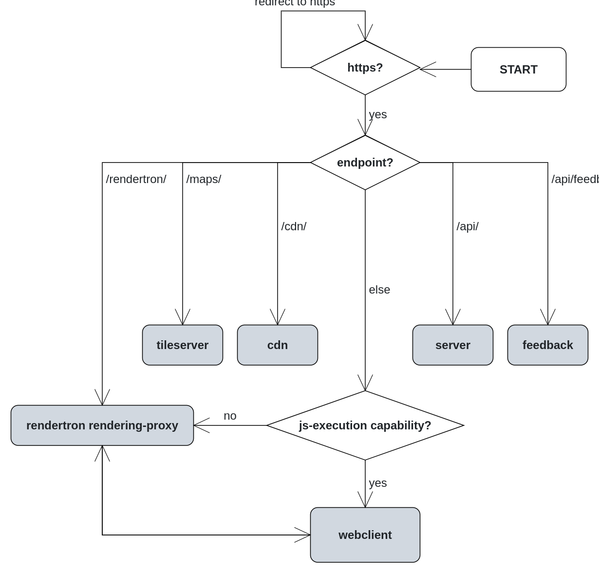
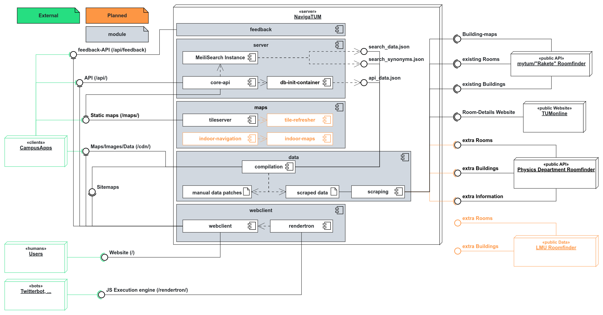

# Deployment

This Project details how to deploy the NavigaTUM-API, the webclient and the CDN

The documentation for the specific sub-services can be found in the respective directories:

- [Data](../data/README.md)
- [API Server](../server/README.md)
- [Website](../webclient/README.md)
- [Maps](../map/README.md)
- [Feedback](../feedback/README.md)

## General description

The general request-Flowchart is the following:  

The project is layed out in this sense:  

Genreral information:

- For the deployments we use [containerd](https://containerd.io/) and [k3s](https://k3s.io/).
- Deployments are automatically done via [argocd](https://argo-cd.readthedocs.io/).
- Inside k3s [traefik](https://traefik.io/) redirects the requests to the correct container.
- The https-certificate is provided by [Let's Encrypt](https://letsencrypt.org/) and managed by [cert-manager](https://cert-manager.io/).
- we use [prometeus](https://prometheus.io/) and [allertmanager](https://prometheus.io/docs/alerting/latest/alertmanager/) for monitoring purposes.

### Environment Based Deployment

We have two different kinds of environments:

- staging
- production

The only difference between the two is, that production has some extra secrets.
Namely:

- we don't publish our `GITHUB_TOKEN` to git. (used to pass feedback from the webclient to github)
- we don't publish the `JWT_KEY` to git. (used to generate tokens to ratelimt feedback creation)
- we don't publish the `MEILI_MASTER_KEY` to git. (used as aditional layer of network hardening between the webclient and the server)

Deployment happens on push to main, or on push to a PR.
For PRs we only execute this deployment request, if the autor is a member of the `@TUM-Dev/navigatum`-group or a member authorises this PR to run actions.
The reasoning is, that we don't want strangers to be able to fork our project, change the deployment to something malicious and make us deploy it.

### ansible

We use [ansible](https://www.ansible.com/) to deploy the k3s cluster.
As an additional dependency you need to `ansible-galaxy collection install kubernetes.core`
